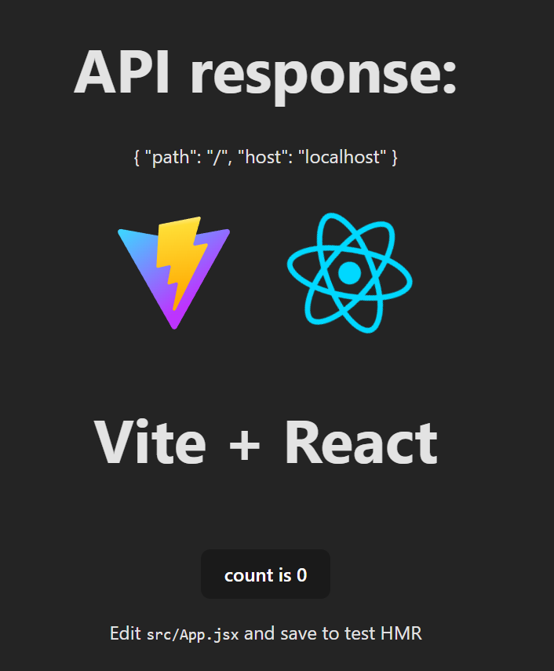

# reactjs-docker-image-testo

Quick test of how to put an ReactJS app into a Docker image for use in Docker containers.

This Docker image is available on this repository's GitHub Packages page, [here](https://github.com/AlexStormwood/reactjs-docker-image-testo/pkgs/container/reactjs-docker-image-testo).

## Wait, containerising ReactJS?

Yeah, it's got a very niche use case. Majority of developers will never ever need to containerise their ReactJS apps. Especially if you're only making a static web app, even a single-page web app!

However, if you're big into "self-hosting" or just aren't relying on cloud providers to run your software, this could be helpful.

Essentially, this helps your website run in an organised container service. It allows you to configure a back-end application (e.g. an ExpressJS application) in a container within the same container network, and allows the front-end and back-end to be developed in a decoupled way.

For example, the server could actually be long-lived instead of "serverless" or "lambda"-styled - user sessions could be easier to manage, resource-intensive tasks like big uploads or streams could be doable without chewing up gigantic cloud platform budgets, and so on. And the front-end can be right there, in a container next door, ready to access those back-end containers and be accessible by users on your network.

Basically, I see this as a cool thing for enterprises to configure for their internal apps and tools. I don't see this as a thing for the general global internet to access and use - though I'm sure you could configure that too, if you wanted to. It's a container. There's so many possibilies for how you use apps if you're managing your own infrastructure like this.

If you're looking at this and going "gee, I develop my React apps to run on Netlify or other static website hosts for the whole world to see", then you don't need this at all.

## Usage

This project automatically builds itself into Docker images upon every push to the repo.

So, you can make your own Docker Compose file to download that Docker image and use it in a service.

You can map whatever port you like to it, as long as it maps to an internal port of 80.

Here's an example:

```yml
name: Full-stack Dockerized
services:
  backend:
    image: ghcr.io/alexstormwood/expressjs-docker-image-testo:latest
    container_name: expressjstesto
    ports:
      - 5050:5000
    restart: unless-stopped
  frontend:
    image: ghcr.io/alexstormwood/reactjs-docker-image-testo:latest
    container_name: reactjstesto
    ports:
      - 5000:80
    environment:
      - APP_ENV_PREFIX=VITE_
      - VITE_BACKEND_NETWORK_HOSTNAME=localhost
      - VITE_BACKEND_NETWORK_PORT=5050
    restart: unless-stopped
```

You may note that in the ReactJS app, it makes a fetch request to an API. It is intended to make a request to a container named `expressjstesto`, running in the same Docker app. 

Now, if you learned _some_ Docker already, you may fall for a trap: Docker automatically allows services within the same app to communicate with each other, via the container name and mapped port. The ReactJS container terminal/exec shell can ping the ExpressJS container at `http://expressjstesto:5000` - that is the containers networking with each other, using internal ports as ports and container names as hostnames or domain names.

But ReactJS apps aren't making requests at a container level. They make fetch requests when they're running in the browser. The browser is not the same as the container. It gets weird, I know.

Basically, we do not want to use Docker networking like:

```
http://expressjstesto:5000/
```

Instead, we want to use browser-level networking like:

```
http://localhost:5050/
```


So, JavaScript code like this:

```js
targetUrl = `http://${environment.BACKEND_CONTAINER_NAME}:${environment.BACKEND_CONTAINER_PORT}/`;
```

Expects environment variables declared in the Docker Compose file named `VITE_` plus the variable name. This lets the `targetUrl` string value become:

```
http://localhost:5050/
```

We're not using `import.meta.env` environment variables from Vite, as they are set at the ReactJS app build time - not helpful for us when we're setting the environment variables at runtime via the Docker Compose file. If you wanted to use a different backend hosted somewhere else in the world, the ReactJS app container has the environment variables configurable to allow that. 

Anyway, a chunk of this project is based on this tutorial, with some tweaks and optimisations: [https://dev.to/dutchskull/setting-up-dynamic-environment-variables-with-vite-and-docker-5cmj](https://dev.to/dutchskull/setting-up-dynamic-environment-variables-with-vite-and-docker-5cmj)


All of this to say that an `App.jsx` component like in the project's [App.jsx file](./src/App.jsx), will render a page like this:

